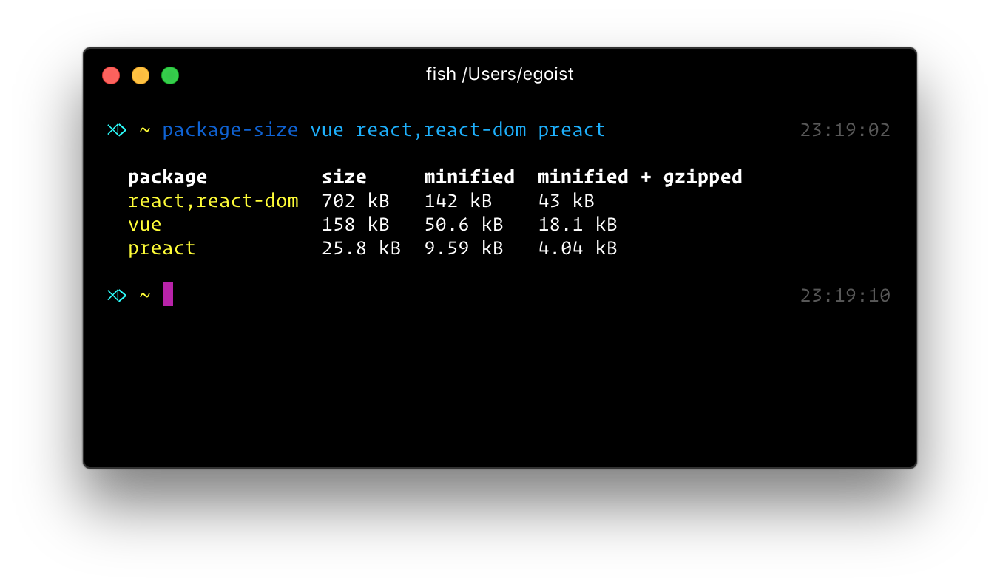

<p align="center">
<h1 align="center">package-size</h1>
</p>

<p align="center">
<a href="https://npmjs.com/package/package-size"></a> <a href="https://npmjs.com/package/package-size"></a> <a href="https://circleci.com/gh/egoist/package-size"></a> <a href="https://github.com/egoist/donate"></a>
</p>

<p align="center">

</p>

## Install

```bash
yarn global add package-size
```

## Usage

```bash
# get the size of vue bundle
package-size vue

# get the size of react+react-dom bundle
package-size react,react-dom

# get the size of vue react+react-dom preact bundles
package-size vue react,react-dom preact

# get the size of file in current working directory
package-size ./dist/index.js
# or a package in current working directory, explictly using `--cwd` flag
package-size vue --cwd

# or event multiple versions for the same package!
package-size react@0.10 react@0.14 react@15
```

If the package contains ES6 code, please use `--es6` option, otherwise it will throw error (uglifyjs can't parse ES6 code).

## API

```js
const getSizes = require('package-size')

getSizes('react,react-dom', options)
  .then(data => {
    console.log(data)
    //=>
    {
      name: 'react,react-dom',
      size: '12023', // in bytes
      minified: '2342',
      gzipped: '534'
    }
  })
```

### options

#### es6

Type: `boolean`<br>
Default: `false`

Compile ES6 to ES5 using `buble`.

#### sort

Type: `boolean`<br>
Default: `false`

Sort packages in size (from small to large).

#### cwd

Type: `boolean`<br>
Default: `false`

Resolve modules in current working directory instead of a cache folder. Relative path will set `cwd` to `true` by default.

#### externals

Type: `string` or `Array<string|RegExp>`<br>
Default: `undefined`

The package to exclude from bundled file, for example, to get the bundle size of `styled-jsx/style` we need to exclude `react`:

```bash
package-size styled-jsx/style --externals react
```

Note that if some item in `externals` is provided as string, it will be wrapped in a regular expression. For example: `react` is treated as `/^react$/`

## Contributing

1. Fork it!
2. Create your feature branch: `git checkout -b my-new-feature`
3. Commit your changes: `git commit -am 'Add some feature'`
4. Push to the branch: `git push origin my-new-feature`
5. Submit a pull request :D

## Author

**package-size** © [EGOIST](https://github.com/egoist), Released under the [MIT](https://egoist.mit-license.org/) License.<br>
Authored and maintained by EGOIST with help from contributors ([list](https://github.com/egoist/package-size/contributors)).

> [egoistian.com](https://egoistian.com) · GitHub [@egoist](https://github.com/egoist) · Twitter [@rem_rin_rin](https://twitter.com/rem_rin_rin)
